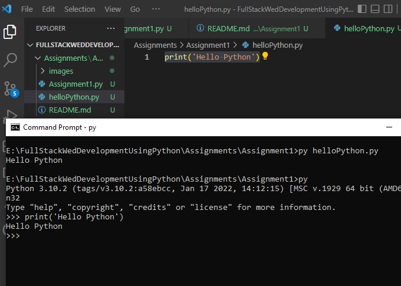

# Assignment 1:Warm-up with python

### 1. Write a command to get the Python version you are using.

### Ans : We can type the command on CMD
```
                                                                                                                                                                            E:\FullStackWedDevelopmentUsingPython>cd Assignments                                                                                                                                                                                                                                                                                            E:\FullStackWedDevelopmentUsingPython\Assignments>cd Assignment1                                                                                                                                                                                                                                                                                E:\FullStackWedDevelopmentUsingPython\Assignments\Assignment1>py --version                                                    
                                                                                                                                    Python 3.10.2     python version
```


> we can know python version through python code
```
    import sys

    print(sys.version)

```


### 2. Write a python script to print Hello Python on the screen directly in the command line.

### Ans : We can directly write in CMD using 
```
    py (or) python
    E:\FullStackWedDevelopmentUsingPython\Assignments\Assignment1>py

```


### 3. Write a python script and store it in a file and execute the file from the command line.

### Ans : let's create a python script file to reverse the user input called it as 'Reverse.py'
```
    print('Enter any input :')
    user_input = input()
    print()
    print(user_input[::-1])

```
>Output:


### 4. Write a python script to print Hello Python on the screen using visual studio code.

### Ans : Print "Hello Python" on the screen using visual studio code


### 5. Write a python script to print Hello on the first line and Python on the second line.

### Ans : using '\n' between the two words the output is as expected :


### 6. Write a python script to print “MySirG” on the screen

### Ans : let's 'MySirG' print on the terminal screen.


### 7. Write a python script to print “Teacher’s Day” on the screen.

### Ans : let's “Teacher’s Day” print on the terminal screen.


### 8. Write a python script to print the value of a variable. Variable contains your name as data.

### Ans : 


### 9. Write a python script to create variables to store your name, age, qualification, years of experience and print it.

### Ans : 


### 10. Write a python script to print values of three variables, each in a new line. Variable contains integer values.

### Ans :
