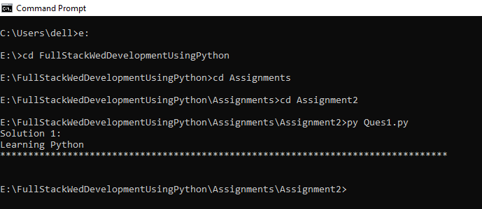
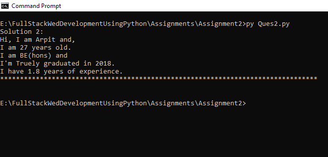
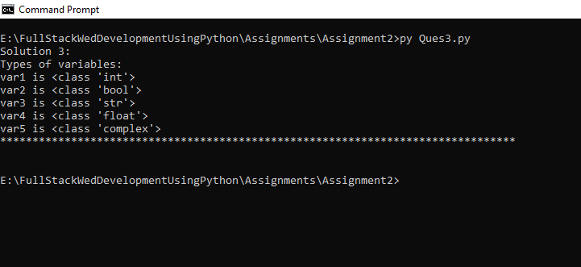
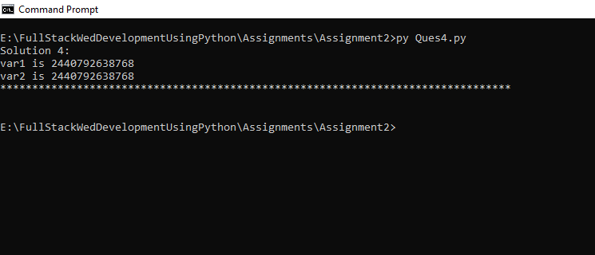
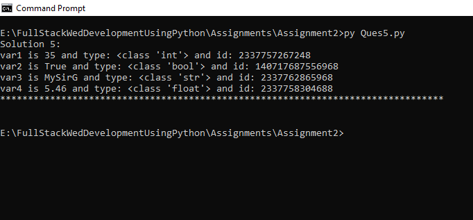
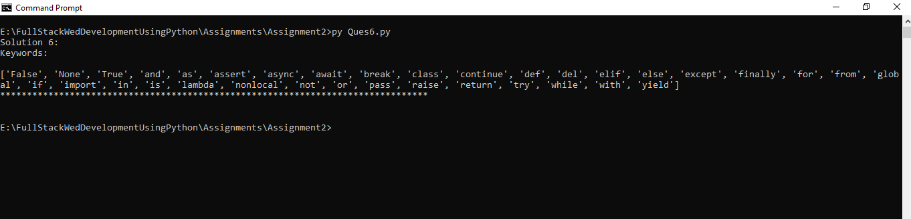
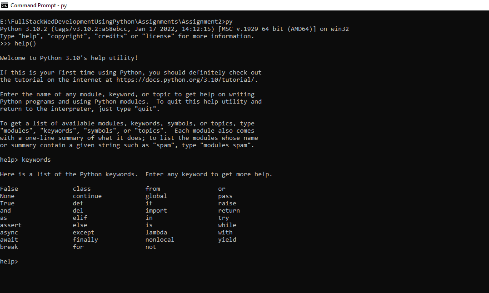
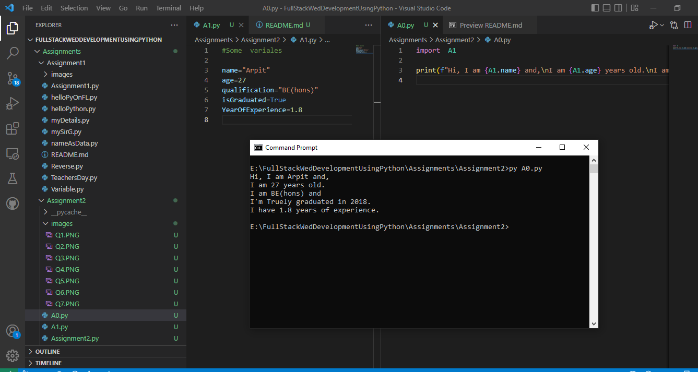
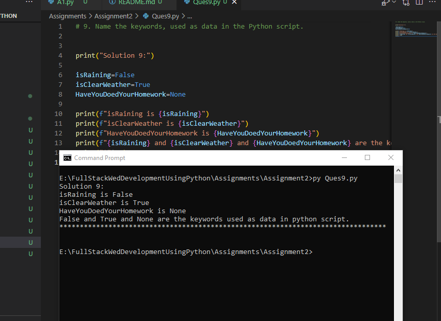
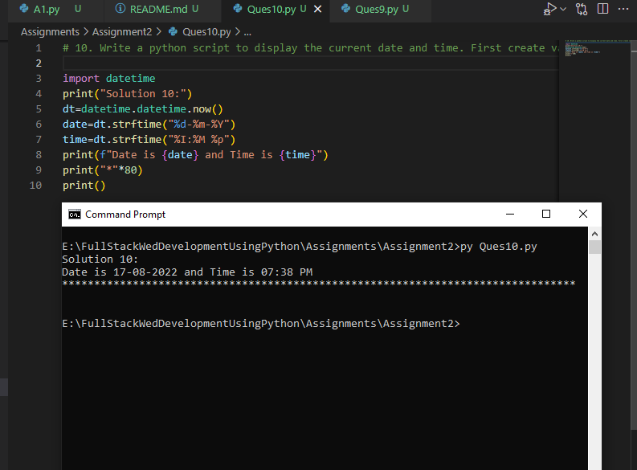

# Assignment-2: Python Basics

### 1. Write a python script to add comments and print “Learning Python” on screen.

```
#Comment:for this solution we are using print statement

print("Solution 1:")
print("Learning Python")
print("*"*80)
print()
```



### 2. Write a python script to add multi line comments and print values of four variables,
each in a new line. Variable contains any values.

```
"""
This is a multi-line comment
"""

print("Solution 2:")
name="Arpit"
age=27
qualification="BE(hons)"
isGraduated=True
YearOfExperience=1.8
print(f"Hi, I am {name} and,\nI am {age} years old.\nI am {qualification} and \nI'm {isGraduated}ly graduated in 2018.\nI have {YearOfExperience} years of experience.")
print("*"*80)
print()
```




### Write a python script to print types of variables. Create 5 variables each of them  containing different types of data. (like 35, True, “MySirG”,5.46, 3+4j, etc)

```
print("Solution 3:")
print("Types of variables:")
var1=35
var2=True
var3="MySirG"
var4=5.46
var5=3+4j
print(f"var1 is {type(var1)}")
print(f"var2 is {type(var2)}")
print(f"var3 is {type(var3)}")
print(f"var4 is {type(var4)}")
print(f"var5 is {type(var5)}")
print("*"*80)
print()
```



### 4. Write a python script to print the id of two variables containing the same integer   values.

```
print("Solution 4:")
var1=35
var2=35
print(f"var1 is {id(var1)}")
print(f"var2 is {id(var2)}")
print("*"*80)
print()
```


### 5. Create four variables in a Python script and assign values of different data types to them. Write a Python script to print value, its type and id of each variable

```
print("Solution 5:")
var1=35
var2=True
var3="MySirG"
var4=5.46
print(f"var1 is {var1} and {type(var1)} and {id(var1)}")
print(f"var2 is {var2} and {type(var2)} and {id(var2)}")
print(f"var3 is {var3} and {type(var3)} and {id(var3)}")
print(f"var4 is {var4} and {type(var4)} and {id(var4)}")
print("*"*80)
print()
```



### 6. Write a python script to print all the keywords

```
print("Solution 6:")
import keyword
print("Keywords:\n")
print(keyword.kwlist)
print("*"*80)
print()
```




### 7. On Python shell use help() function and display the list of keywords

```
import PIL.Image  as  pi  #importing PIL.Image module
print("Solution 7:")

"""
Steps:
1. Open your CMD prompt and type "py"
2. Type "help()"
3. Type "keywords"
4. You got all the keywords in the list.
5. Close your CMD prompt
"""
print("The image is:")
img = pi.open(r"./Assignments/Assignment2/images/Q7.PNG")
img.show()
print("*"*80)
print()

```




### 8. Create two Python files A0.py and A1.py. Create a variable in A1.py and assign some value to it. Write a python script to import A1 module in A0 and print value of the  variable created in A0.py


```
print("Solution 8:")
print("Importing A1 module in A0 and printing value of the variable created in A0.py")

import A1,A0
print(A0.print_Variable)

print("*"*80)
print()
```


### 9. Name the keywords, used as data in the Python script.

```
print("Solution 9:")

isRaining=False
isClearWeather=True
HaveYouDoedYourHomework=None

print(f"isRaining is {isRaining}")
print(f"isClearWeather is {isClearWeather}")
print(f"HaveYouDoedYourHomework is {HaveYouDoedYourHomework}")
print(f"{isRaining} and {isClearWeather} and {HaveYouDoedYourHomework} are the keywords used as data in python script.")
print("*"*80)
print()
```


### 10. Write a python script to display the current date and time. First create variables to store date and time, then display date and time in proper format (like: 13-8-2022 and 9:00 PM)

```
import datetime
print("Solution 10:")
dt=datetime.datetime.now()
date=dt.strftime("%d-%m-%Y")
time=dt.strftime("%I:%M %p")
print(f"Date is {date} and Time is {time}")
print("*"*80)
print()
```


