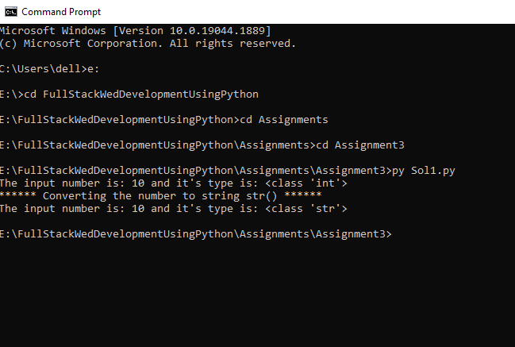
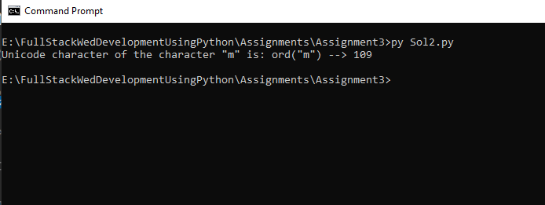
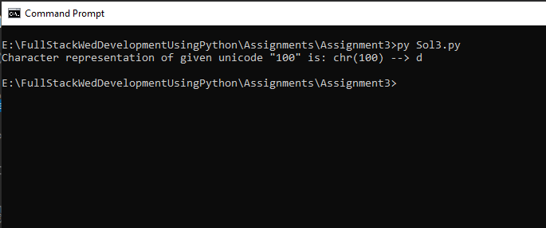
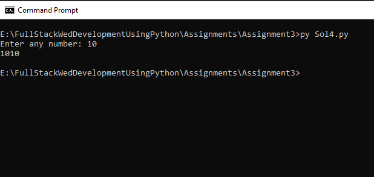
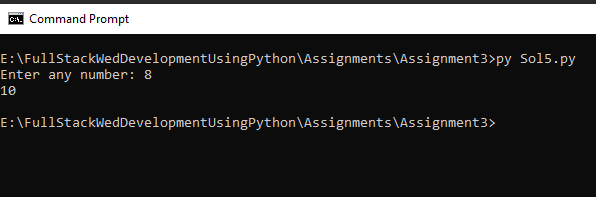
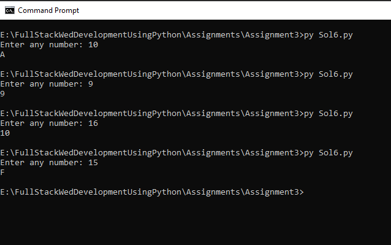
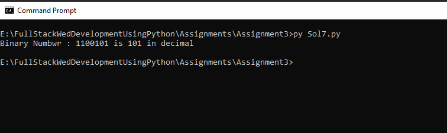
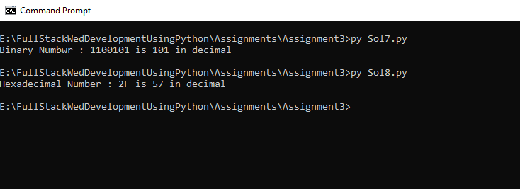
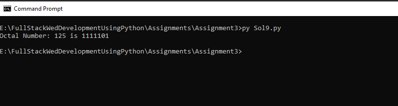
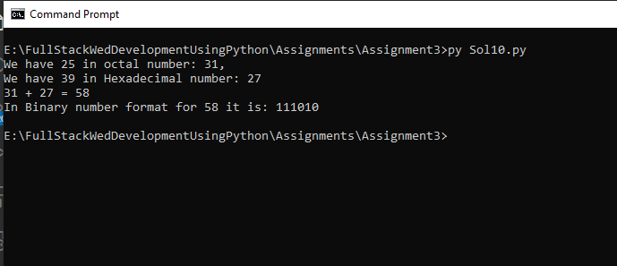

# Assignment-3: Type Conversion

### 1. Write a python script to convert a number into str type.

Answer:

We can convert number into string type by using the inbuilt method ```str()```




### 2. Write a python script to print Unicode of the character 'm'

Answer:



### 3. Write a python script to print character representation of a given unicode 100.

Answer:



### 4. Write a python script to print any number and its binary equivalent

Answer:



### 5. Write a python script to print any number and its octal equivalent

Answer:




### 6. Write a python script to print any number and its hexadecimal equivalent

Answer:




### 7. Write a python script to store binary number 1100101 in a variable and print it in decimal format

Answer:




### 8. Write a python script to store hexadecimal number 2F in a variable and print it in octal format

Answer:



### 9. Write a python script to store octal number 125 in a variable and print it in binary format

Answer:




### 10. Write a python script to add two number 25 (in octal) and 39 (in hexadecimal) and display the result in binary format.

Answer:



